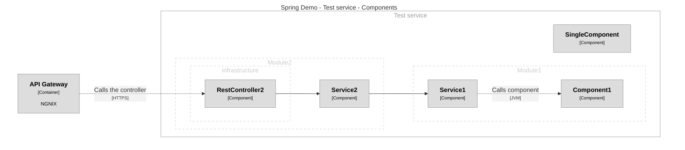

This project contains a dedicated maven plugin for generating a [Structurizr](https://structurizr.com/) DSL code representing a single C4 container,
which then can be included as a part of other, bigger eco-system.

## Plugin usage
Current plugin version in its early development stage supports only Spring based applications and processes
all Java classes in selected packages conforming given criteria:

- class is annotated with Spring `@Component` annotation or its derivative, eg: `@Service`, `@RestController`, etc,
- or implements `org.springframework.data.repository.Repository` or its supertype, eg: `org.springframework.data.r2dbc.repository.R2dbcRepository`

Here is an example plugin configuration (from [structurizr-spring-demo](structurizr-spring-demo)):
```xml
<project>
    ...
    <properties>
        <structurizr-generator.version>0.0.1</structurizr-generator.version>
    </properties>
    ...
    <build>
        <plugins>
            <plugin>
                <groupId>com.structurizr.generator</groupId>
                <artifactId>structurizr-maven-plugin</artifactId>
                <version>${structurizr-generator.version}</version>
                <executions>
                    <execution>
                        <goals>
                            <goal>dsl-generator</goal>
                        </goals>
                    </execution>
                </executions>
                <configuration>
                    <scanPackages>
                        <scanPackage>com.structurizr.demo</scanPackage>
                    </scanPackages>
                    <exclusions>
                        <supertypes>
                            <supertype>org.springframework.core.convert.converter.Converter</supertype>
                        </supertypes>
                    </exclusions>
                    <container>
                        <id>test</id>
                        <name>Test service</name>
                    </container>
                    <outputDirectory>${project.basedir}/c4/model</outputDirectory>
                </configuration>
                <dependencies>
                    <dependency>
                        <groupId>com.structurizr.generator</groupId>
                        <artifactId>structurizr-components-finder-spring</artifactId>
                        <version>${structurizr-generator.version}</version>
                    </dependency>
                </dependencies>
            </plugin>
        </plugins>
    </build>
</project>
```
As an output of its actions plugin generates a single `container.dsl` file under location determined by
`outputDirectory` configuration parameter. To run the plugin goal follow the Maven goal naming strategy:
```bash
mvn structurizr:dsl-generator
```

## Plugin configuration
Maven plugin itself gives certain level of configurability by setting few configuration parameters.

| Parameter         | Meaning                                                                         | Type                                      |
|-------------------|---------------------------------------------------------------------------------|-------------------------------------------|
| `scanPackages`    | List of java packages to be scanned in order to extract Components in Container | java.lang.String[]                        |
| `outputDirectory` | Target location of generated `container.dsl` file                               | java.io.File                              |
| `container`       | Configuration of the Container to be generated.                                 | com.structurizr.mojo.StructurizrContainer |
| `exclusions`      | List of types to be excluded from Components extraction                         | com.structurizr.mojo.Exclusions           |

**com.structurizr.mojo.StructurizrContainer**

| Parameter | Meaning                                                                 | Type             |
|-----------|-------------------------------------------------------------------------|------------------|
| `id`      | This value will be used as a name of the container declaration variable | java.lang.String |
| `name`    | Target name of Structurizr Component element                            | java.lang.String |

**com.structurizr.mojo.Exclusions**

| Parameter    | Meaning                                                                                 | Type             |
|--------------|-----------------------------------------------------------------------------------------|------------------|
| `supertypes` | Collection of all all ignored supertypes (extending classes or implementing interfaces) | java.lang.String |

## Plugin output
When ran against [structurizr-spring-demo](structurizr-spring-demo) and converted to Mermaid produces given output:



# Java annotations
TODO: write usage description